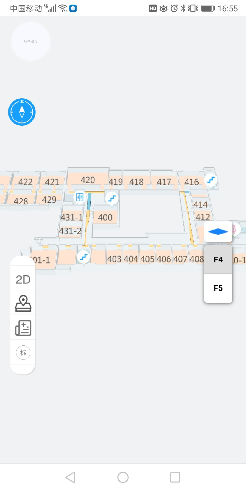
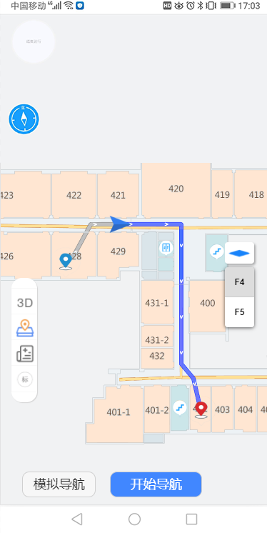
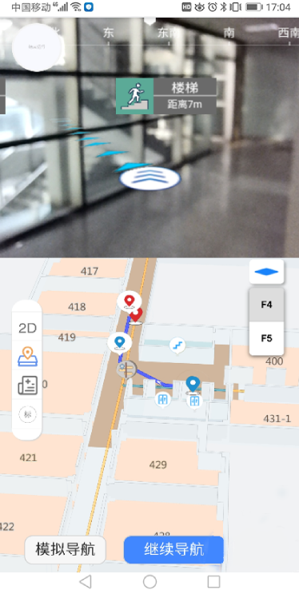

### 项目介绍

  本项目是一个室内AR导航地图系统，能够对室内地图数据进行可视化，并根据设置的起点和终点进行路径规划，前端界面基于Vue进行开发，AR部分基于Three.js完成，能够获取用户摄像头，并根据陀螺仪获取手机的姿态，将虚拟导航路线与拍摄的真实影像进行叠加实现AR导航功能。

### 项目运行

项目使用vue-cli4

``` npm run serve    #运行项目
npm run serve    #运行项目
npm run build    #打包项目
```

### 系统展示

#### 系统界面

<div>
    
</div>

#### 模拟导航

<div>
    
</div>

#### AR导航

<div>
    
</div>
